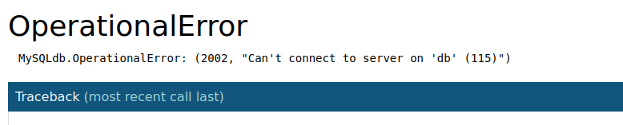
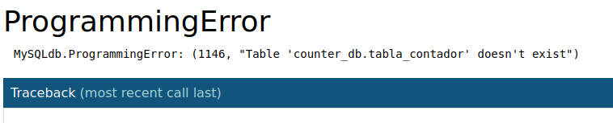

# Flask Counter

**Flask Counter** es una aplicación web muy sencilla que cuenta y almacena el número de veces que se ha visualizado la página web.

El número de visitas se guarda en una base de datos MySQL y la aplicación está escrita en python utilizando Flask.

## Flask Counter con Docker

### Requisitos

Para hacer funcionar Flask Counter necesitarás instalar `Docker` en tu máquina. Si tu versión de Docker es antigua puede que no tenga incorporado el plugin `Docker Compose`, para comprobar que lo tengas instalado puedes ejecutar el siguiente comando:
```
docker compose version
```

Y si lo tinenes instalado te mostrará un mensaje parecido a este:
```
Docker Compose version v2.16.0
```

Si no tienes el plugin instalado puedes instalarte el binario docker-compose o instalar una versión nueva de Docker que ya cuentan con el plugin incluido.

### Iniciar Flask Counter

> ¡AVISO! Utilizar la aplicación con las configuraciones por defecto de la base de datos es muy inseguro. Deberías cambiarlas antes de instalar la aplicación. Mira el apartado de configuración más abajo.

Descargate el repositorio, y con la terminal situate en el directorio de la aplicación, en la ubicación donde se encuentra el fichero README.md, Dockerfile, etc.. Ahora ejecuta el siguiente comando:
```
docker compose up -d
```
> En el caso de utilizar el binario de Docker Compose, en lugar de escribir `docker compose`, deberías escribir `docker-compose`.

Esto pondrá en marcha los contenedores, los volúmenes y la red para que la aplicación funcione. Puedes comprobar que la aplicación funciona introduciendo en el navegador la url `localhost:5005`.


> ¡AVISO! La base de datos tarda unos 20 segundos en configurarse y si comprobamos la aplicación nada más montar nos dará este error:
>
>
>
> `MySQLdb.OperationalError: (2002, "Can't connect to server on 'db' (115)")`
>
> Pero es cuestión de esperar unos segundos.

La aplicación nos muestra el número de visitantes que ha tenido. Y podemos hacerlo incrementar recargando la página. El hecho de que al recargar la página se incremente el contador es una muestra de que el número de visitas se obtiene de una base de datos. De lo contrario, una página web estática, al recargar la página perdería la información de visitas y empezaría siempre desde cero sin poder aumentar.

#### Resetear contador

También tiene la funcionalidad de resetear el número de visitas si visitamos la url `localhost:5005/inicializa-contador`

### Configuraciones

Esta aplicación permite algunas configuraciones mediante variables de entorno. La aplicación tiene unos valores por defecto para estas configuraciones por lo que funcionará sin que se le indique ninguna configuración personalizada.

Las variables de entorno con las que configuramos esta aplicación están escritas en el fichero `.env`. En este fichero podremos personalizar algunas características de MySQL (contraseña de root, nombre de usuario, contraseña de usuario, nombre de la base de datos y el host) y el puerto de la máquina HOST para acceder a la aplicación, que por defecto es 5005.

### Persistencia de datos
Los datos de la base de datos son persistentes debido a que están construidos sobre un volumen externo al contenedor de MySQL. Si queremos comprobar que la persistencia podemos eliminar los contenedores de la aplicación y después volver a crearlos con los comandos:
```
docker compose down
docker compose up -d
```

Si volvemos a abrir la aplicación en el navegador podremos comprobar que el número de visitas continúa en el número en el que estaba antes de eliminar los contenedores. Por lo que la información no se ha perdido a pesar de destruir los contenedores.

Si quisieramos destruir también el vólumen con los datos, además de los contenedores ejecutarioamos el siguiente comando:
```
docker compose down -v
```

## Flask Counter con Kubernetes

### Requisitos

Necesitaremos instalar metrics-server e ingress para desplegarlo. Con minikube sería con los siguientes comandos:
```
minikube addons enable metrics-server
minikube addons enable ingress
```

### Despliegue

Situándonos en el directorio `k8s` ejecutamos este comando:
```
kubectl apply -f .
```

#### Comprobar la aplicación

Si estamos utilizando minikube, para ver la aplicación en el navegador utilizamos la ip de minikube que lo obtenemos con el siguiente comando:
```
minikube ip
```
Ej: `192.168.49.2` y `192.168.49.2/inicializa-contador`

Requiere unos 20 segundos desde que despliega para que esté todo funcionando.

Es posible que la base de datos no se halla configurado automáticamente. Cuando esto sucede, el navegador nos mostrará el siguiente error:



Si se nos muestra este error tenemos que ejecutar el siguiente comando:
```
k exec --stdin --tty sfs-mysql-0 -- bash /docker-entrypoint-initdb.d/init_db.sh
```


### Desinstalar la aplicación

```
kubectl delete -f .
```
### Configuración

Los valores configurables de la aplicación están con codificación en `base64` en el fichero `secrets-mysql.yaml`. Para cambiarlos edita el fichero añadiendo los nuevos valores codificados.

## Flask Counter con Helm


### Requisitos

Necesitarás instalar `Helm` en tu equipo. [Link para instalar Helm](https://helm.sh/docs/intro/install/)

### Desplegar la aplicación

Desde el directorio `helm-chart` ejecutamos:
```
helm install miapp ./
```

### Comprobar la aplicación

Si estamos utilizando minikube, para ver la aplicación en el navegador utilizamos la ip de minikube que lo obtenemos con el siguiente comando:
```
minikube ip
```
Ej: `192.168.49.2` y `192.168.49.2/inicializa-contador`

Requiere unos 20 segundos desde que despliega para que esté todo funcionando.

Es posible que la base de datos no se halla configurado automáticamente. Cuando esto sucede, el navegador nos mostrará el siguiente error:


Si se nos muestra este error tenemos que ejecutar el siguiente comando:
```
k exec --stdin --tty [nombrePodBBDD] -- bash /docker-entrypoint-initdb.d/init_db.sh
```

### Eliminar la aplicación

```
helm uninstall miapp
```

### Configuración de la aplicación

Los valores que quieres modificar los puedes escribir en el ficher `my-values.yaml` y instalar la aplicación de la siguiente manera:

```
helm install -f my-values.yaml miapp ./
```

O podemos escribir directamente algun cambio en el comando:
```
helm install -f my-values.yaml miapp ./ --set ingressEnabled=false
```